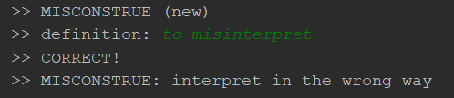

# Vocabation

Welcome to Vocabtion! The is a flashcard-like command line app that helps you learn vocabulary -- but with a twist. You will be shown a word and be required to type in the definition (however you choose to word it). All you need to do is provide a file of vocab words for the program to ingest.

Example:  



### Usage
1) Go ahead and clone the repo
2) ```pip install``` the cloned repo to your local machine
3) Run ```python -m vocabtion```. Upon running, go ahead and add a vocab set to begin practicing on.

4) The following commands are supported:

- ```add vocab_set_path```: add a vocab set. The parameter ```vocab_set_path``` is the path of a file that contains a list of vocab words. Some sample files are in the ```/vocabation/vocab``` folder. Upon adding the vocab set you will be prompted to give a name to the vocab set (avoid spaces in your vocab set name).
- ```test vocab_set_name```: Begin testing on a vocab set. The parameter ```vocab_set_name``` is the name of a vocab set you wish to test.
- ```clear vocab_set_name```: clear progress for a vocab set or ```clear all``` to clear progress for all vocab sets
- ```delete vocab_set_name```: delete a vocab set or ```delete all``` to delete all vocab sets.


### Further work
- Currently using datamuse api to make requests to OneLook reverse dictionary (this requires internet connection and has limited api calls). Need to develop own reverse dictionary.
- The scoring method is (*very*) loosely based off of Magoosh's GRE flashcard memorization method (which utilizes Spaced Repetition Technique). Need to improve this technique.
- The definition being returned for a word is the first definition of a word provided by Wordnet. Wordnet provides many definitions for a word, need to summarize all the definitions and return them.

### Contact:
Cathy Jiao  
Email: cathy.jiao@gmail.com

Comments and suggestions are welcome! However, you may expect a delayed response as I am in school.

##### Resources
OneLook Reverse Dictionary: https://www.onelook.com/thesaurus/   
Wordnet: http://www.nltk.org/howto/wordnet.html  
Magoosh FlashCards:  https://magoosh.com/gre/2013/announcing-our-gre-vocabulary-flashcard-app/